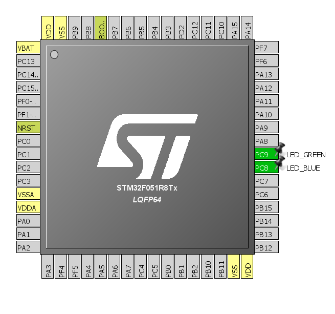

## STM32 HAL BLOCKING blinky ##

This project uses HAL_Delay() function to delay blinking process - and is used just for reference.
Do not **EVER** use blocking delay functions!!

Learning objectives:
- How to use GPIO as an output

STM32F051C8 LQFP64 processor on the STM32F0Discovery board was used for developing.

Project pinout:

